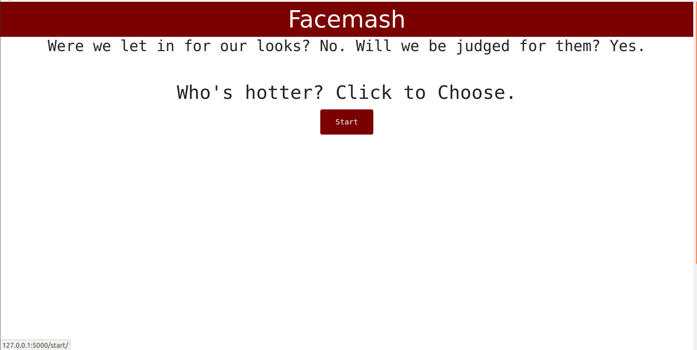

## Facemash

Clone of facemash using Elo algorithm

Click on start to proceed

## Installation and Dependencies:

	Run:  pip -r requirements.txt

## To scrape images:
Go inside spiders folder and run:

	scrapy runspider massScraper.py

Then move all the images from /image_scraper/data/full to /masher/static/images/ folder

## To run facemash:
Go inside masher folder and run:

	python mash.py
